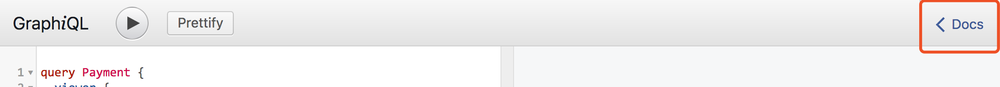
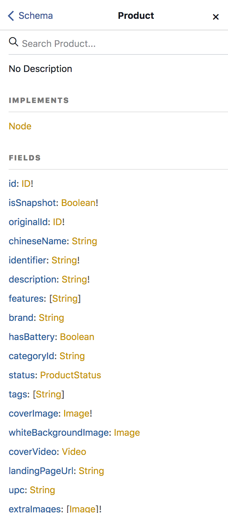

# Shoppo API Demo

### API Endpoint: https://graphql-dev.shoppo.com
To use our APIs, you need to `POST` a `GraphQL` compatible request body to our API endpoint. And you will get a `JSON` response.

### API Authencation(put in header)
- Content-type: application/json
- accesstoken: "your accesstoken"
- viewerid: "your viewerid"

### API Playground
You can explore our APIs with GraphiQL here: [https://graphql-dev.shoppo.com/console](https://graphql-dev.shoppo.com/console)


#### How to use Playground as a API reference
With GraphiQL, we can see a `docs` menu in the top right(as shown below)


In the menu, we can see our GraphQL Schema. Basically, `RootQuery` for supported query objects, and `RootMutation` for supported mutations. And of course, we can search a specific schema in the search box. For example, we search `Product` and see what is a `Product`.



As shown in the screenshot, all supported field are listed with name and type and we can know if the field is required. If we click on the field name, we can get a simple description of the field.

### Service Definition
`Sku` is what our customers really see in our app. It contains specifications of the stuff(ex. length, color). Basic info of the stuff are in `Product` objects. A product can have **many** skus.

### Demo Query Object(product search):

You can use this query object in either GraphiQL playground or with `curl`(shown below).

```
query Test {
  productSearch {
    skus(first:10) {
      length
      edges {
        node {
          id
        }
      }
    }
  }
}
```

### Play with curl

To play with `curl`, we need a valid `GraphQL` request body. The format is: `{"query":"","variables":{},"operationName":""}`.

An example using Product Feed Query Object(listed beyond) is like this:

```
curl \
  -X POST \
  -H "Content-Type: application/json" \
  -H "accesstoken: your_access_token" \
  -H "viewerid: your_viewer_id" \
  --data '{"query":"query AdminSkuFeed { \n  productSearch {\n    skus(first:10) {\n      length\n      edges {\n        node {\n          id\n        }\n      }\n    }\n  }\n}\n","variables":{"mode":"feed","boostOverrides":[],"first":24,"after":""},"operationName":"AdminSkuFeed"}' \
  https://graphql-dev.shoppo.com/api/graphql
```

### Using Java:

These links may help:

* [apollo-android](https://github.com/apollographql/apollo-android)
* [graphql_java_gen](https://github.com/Shopify/graphql_java_gen)
* [graphql-java](https://github.com/graphql-java/graphql-java)
