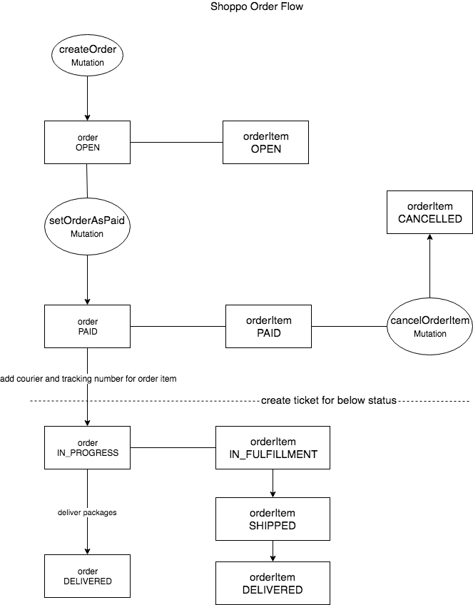

## Order List

```graphql
query orderList(
    $first: Int,
    $last: Int,
    $after: String,
    $before: String,
    $filters: OrderFilterInput,
) {
  orderList(
    first: $first,
    last: $last,
    after: $after,
    before: $before,
    filters: $filters,
  ) {
    length
    edges {
      node {
        id
        status
      }
    }
  }
}
```

Variables:

Name | Type | Required | Description
--- | --- | --- | ---
first | Int | | limit size
last | Int | | limit size
after | String | | offset cursor
before | String | | offset cursor
filters | [OrderFilterInput](#orderFilterInput) | | filter parameters

`OrderFilterInput` fields:

Name | Type | Required | Description
--- | --- | --- | ---
timeCreatedRange | [Int, Int] | | filter by created time range, time format is `unix timestamp`

Response order list fields:

field name | type | required | description
--- | --- | --- | ---
length | Int | True | total matches count
edges | List | True | order node list
edges.node | [Order](#orderNode) | | order node, please see [Order](#orderNode) definition below

## Shoppo Order Workflow



## Create Order

Create order with Sku items and shipping address.

* When created, order status is unpaid.
* When user paid the order, call another request to set the order as paid.
* When user cancel the order before paid, call another request to cancel the order.

Create Order Mutation:
```graphql
mutation createOrder(
  $shippingAddress: ShippingAddressInput!,
  $orderItems: [OrderItemInput!]!,
) {
  createOrder(
    shippingAddress: $shippingAddress,
    orderItems: $orderItems,
    ){
      order {
        id
        status
        orderItems {
          id
          sku {
            originalId
            price
          }
          product {
            originalId
            name
          }
          quantity
        }
      }
  }
}
```

Response order structure details, please see [Query Order](#queryOrder)

Variables:

Name | Type | Required | Description
--- | --- | --- | ---
shippingAddress | [ShippingAddressInput](#shippingAddress) | True | address object
orderItems | [[OrderItemInput](#orderItemInput)!]! | True | order items contains Sku ID and quantity

<a name="orderItemInput" />
OrderItemInput Fields:

Name | Type | Required | Description
--- | --- | --- | ---
skuId | ID | True | Sku relay id
quantity | Int | True | buy Sku quantity

<a name="queryOrder" />

## Query Order

Query order with relay id

```graphql
query order($id: ID!) {
  node(id: $id) {
    ... on order {
      id
      orderItems {
        id
        sku {
          originalId
        }
        status
      }
      status
    }
  }
}
```

<a name="orderNode" />

`Order` fields:

Name | Type | Required | Description
--- | --- | --- | ---
discount_amount | Float | True | discount amount
id | ID | True | order relay id
order_items | [[OrderItem](#orderItemNode)] | True | order item list
order_subtotal | Float | True | sum of products amount and shipping fee
order_total | Float | True | customer paid amount
shipping_address | [shippingAddress](#shippingAddress) | True | address object
shipping_cost | Float | True | total shipping fee amount
status | [OrderStatus](#orderStatus) | True | order enums status
time_created | Int | True | unix timestamp for order created at
time_payment_processed | Int | | unix timestamp for order paid at

<a name="queryOrderItem" />

## Query Order Item

```graphql
query orderItem($id: ID!) {
  node(id: $id) {
    ... on orderItem {
      id
      sku {
        id
        originalId
        price
        shippingPrice
      }
      product {
        id
        originalId
        name
      }
      status
    }
  }
}
```

<a name="orderItemNode" />

Order item fields:

Name | Type | Required | Description
--- | --- | --- | ---
id | ID | True | order item relay id
is_refunded | Boolean | | the order item whether is refunded or not
order | [Order](#orderNode) | True | order item's order object
product | [Product](./product.md#productNode) | True | product snapshot
`product.id` | ID | True | product snapshot relay id
`product.originalId` | ID | True | product relay id, if you want retrieve product, use `originalId` other than `id`
quantity | Int | True | number for buy this Sku
refundedAmount | Float | | if order item is refunded, the amount will be return
shippingRefunded | Boolean | | if refunded, the refunded amount whether contains shipping fee or not
sku | [Sku](./product.md#skuNode) | True | sku snapshot
`sku.id` | ID | True | Sku snapshot relay id
`sku.originalId` | ID | True | Sku relay id, if you want retrieve Sku, use `originalId` other than `id`
shippingPackage | [ShippingPackage](#shippingPackage) | | order item's shipping package
shippingProvider | String | | Courier name for shipping package
status | [OrderItemStatus](#orderItemStatus) | True | order item status enum
trackingNumber | String | | tracking number for the package
timeRefunded | Int | | if refunded, unix timestamp for refund created at

<a name="setOrderAsPaid" />

## Set Order as Paid

Before set order as paid, please check the order status and it should be `OPEN`.
When set order as paid successfully, the status will be `PAID`.

```graphql
mutation setOrderAsPaid($orderId: ID!, $chargeId: String!) {
  setOrderAsPaid(orderId: $orderId, chargeId: $chargeId) {
    order {
      id
      status
      timePaymentProcessed
      orderItems {
        id
        status
      }
    }
  }
}
```

Variables:

Name | Type | Required | Description
--- | --- | --- | ---
orderId | ID | True | order relay id to set paid
chargeId | String | True | Partner charge id for the order and should be unique

<a name="cancelOrderItem" />

## Cancel OrderItem

If order is not paid, you don't need cancel order. Only when order item status is `PAID`, you could cancel order item directly, otherwise you need create customer service ticket.

```graphql
mutation cancelOrderItem($orderItemId: ID!) {
  cancelOrderItem(orderItemId: $orderItemId) {
    orderItem {
      id
      status
    }
  }
}
```

Variables:

Name | Type | Required | Description
--- | --- | --- | ---
orderItemId | ID | True | order item relay id to cancel

<a name="shippingAddress" />

## Shipping Address
The address for packages shipped to customer

Fields:

Name | Type | Required | Description
--- | --- | --- | ---
recipientFirstName | String | True | recipient first name
recipientLastName | String | True | recipient last name
streetAddress1 | String | True | Address 1
streetAddress2 | String | True | Address 2
city | String | True | city name
state | String | True | state name
countryCode | [CountryCode](./product.md#countryCode)| True | country code, e.g.  `US` for `United States`
zipcode | String | True | zip code
phoneNumber | String | True | recipient phone number

<a name="orderStatus" />

### Order Status
Order status enums

Value | Description
--- | ---
OPEN | order created
PAID | order has been paid
IN_PROGRESS | packages are being prepared in warehouse
DELIVERED | packages are sent to couriers
CLOSED | customer cancelled the order
EXPIRED | order expired and could not pay for this order

<a name="orderItemStatus" />

### OrderItem Status
OrderItem status enums

Value | Description
--- | ---
OPEN | order has not been paid
PAID | order has been paid
IN_FULFILLMENT | order item package is being prepared in warehouse
SHIPPED | the package is on the way to deliver to customer
DELIVERED | customer confirmed he received the package
CANCELLED | order item is cancelled

<a name="shippingPackage" />

## Shipping Package

Fields:

Name | Type | Required | Description
--- | --- | --- | ---
id | ID | True | relay id
checkpoints | [[Checkpoint](#checkpoint)] | | tracking info
courier | String | True | shipping provider name
isDelivered | Boolean | True | whether package is delivered
status | String | True | packpage current status
timeDelivered | Int | | delivered at, `unix timestamp`
timeLanded  | Int | | landed at, `unix timestamp`
timeShipped | Int | | shipped at, `unix timestamp`
timeTracked | Int | | tracked at, `unix timestamp`
trackingNumber | String | True | tracking number

<a name="checkpoint" />

`Checkpoint` fields:

Name | Type | Required | Description
--- | --- | --- | ---
courier | String | | courier name
time | Int | | checkpoint happened at, `unix timestamp`
message | String | | event description
location | String | | location

<a name="refundReasonType" />

## Refund Reason Type

Reason for refund order item

Value | Description
--- | ---
CUSTOMER_CANCELED | CUSTOMER_CANCELED
OUT_OF_STOCK | Sku OUT_OF_STOCK
BAD_SHIPPING_ADDRESS | BAD_SHIPPING_ADDRESS
AGREEMENT_WITH_USER | AGREEMENT_WITH_USER
FRAUDULENT_PURCHASE | FRAUDULENT_PURCHASE
NOT_SHIPPED_TOO_LONG | NOT_SHIPPED_TOO_LONG
