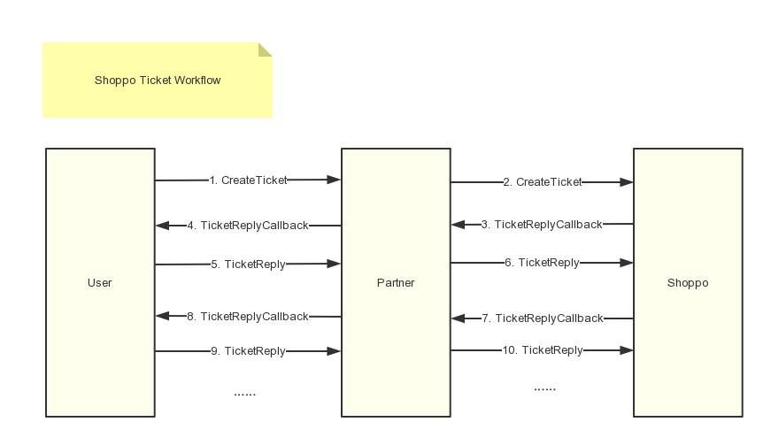

# Content

* [Shoppo Ticket Workflow](#shoppo-ticket-workflow)
* [Ticket List](#ticket-list)
* [Create Ticket](#create-ticket)
* [Query Ticket](#query-ticket)
* [Webhook(Reply Ticket Callback)](#webhookreply-ticket-callback)
* [Reply Ticket](#reply-ticket)


## Shoppo Ticket Workflow



## Ticket List

```graphql
query exchangeItemTicketList(
    $first: Int,
    $last: Int,
    $after: String,
    $before: String,
    $filters: TicketFilterInput,
) {
  exchangeItemTicketList(
    first: $first,
    last: $last,
    after: $after,
    before: $before,
    filters: $filters,
  ) {
    edges {
      node {
        id
      }
    }
    length
  }
}
```

Variables:

Name | Type | Required | Description
--- | --- | --- | ---
first | Int | | limit size
last | Int | | limit size
after | String | | offset cursor
before | String | | offset cursor
filters | [TicketFilterInput](#ticket-filter-input) | | filter parameters

<a name="ticket-filter-input" />

`TicketFilterInput` fields:

Name | Type | Required | Description
--- | --- | --- | ---
timeCreatedRange | [Int, Int] | | filter by created time range, time format is `unix timestamp`

Response ticket list fields:

field name | type | required | description
--- | --- | --- | ---
length | Int | True | total matches count
edges | List | True | ticket node list
edges.node | [Ticket](#ticket-node) | | ticket node, please see [Ticket](#ticket-node) definition below

The same is true for `refundTicketList` and `orderQuestionTicketList`.

## Create Ticket

Creating an exchange item ticket with firstName, lastName, email, reason, orderItems, imageIds and remark.

* When created, the ticket zendeskStatus is `NEW`.
* When customer service replied to the ticket, we will call [Webhook](#webhook-reply-ticket-callback) to reply your ticket.
* There are 6 kinds of ticket status, see status details [here](#ticket-status).

Create Ticket Mutation:

```graphql
mutation CreateExchangeItemTicket(
  $firstName: String!,
  $lastName: String!,
  $email: String!,
  $reason: ExchangeItemReason!,
  $orderItemIds: [ID]!,
  $imageIds: [ID]!,
  $remark: String,
) {
  createExchangeItemTicket(
    firstName: $firstName,
    lastName: $lastName,
    email: $email,
    reason: $reason,
    orderItemIds: $orderItemIds,
    imageIds: $imageIds,
    remark: $remark,
  ){
    ticket{
      reason
      id
      firstName
      lastName
      email
   }
  }
}
```

Response ticket structure details, please see [Query Ticket](#query-ticket).

Variables:

Name | Type | Required | Description
--- | --- | --- | ---
reason | String | True | reason for ticket
id | ID | String | True | return id for reply ticket
firstName | String | True | ticket author's firstname
lastName | String | True | ticket author's lastname
email | String | True | ticket author's email

Similar to creating an exchange item ticket, creating a refund ticket requires firstName, lastName, email, reason, problemType, itemDeliveryStatus and imageIds.Creating a order question ticket requires firstName, lastName, email, itemDeliveryStatus and imageIds.

Variables:

Name | Type | Required | Description
--- | --- | --- | ---
problemType | Enum | True | REFUND, EXCHANGE, NOT_ARRIVED, OTHER
itemDeliveryStatus | Enum | True | RECEIVED, NOT_RECEIVED


## Query Ticket

Query ticket with reply id.

```graphql
query exchangeItemTicket($originalId: ID!) {
  exchangeItemTicket(originalId: $originalId) {
    id
    reason
    originalId
    firstName
    lastName
    email
    status
    zendeskStatus
    remark
    comments{
      length
      edges {
        node {
          content
        }
      }
    }
  }
}
```

<a name="ticket-node" />

`Ticket` fields:

Name | Type | Required | Description
--- | --- | --- | ---
id | ID | True | id
originalId | ID | True | ticket reply id
status | Enum | True | OPEN, CLOSED
zendeskStatus | [TicketStatus](#ticket-status) | True | ticket enums status
firstName | String | True | ticket author's firstname
lastName | String | True | ticket author's lastname
email | String | True | ticket author's email
remark | String | True | remark
comments.edges | List | | ticket comment node list
comments.edges.node | [Comment](#comment-node) | | ticket comment node, please see [Comment](#comment-node) definition below
comments.length | Int | True | total comments matches count

<a name="comment-node" />

Comment Variables:

Name | Type | Required | Description
--- | --- | --- | ---
content | String | True | ticket reply content

## Webhook(Reply Ticket Callback)

We need you to provide a url to accept the `POST` method for the shoppo call to reply ticket.

Post Variables:

Name | Type | Required | Description
--- | --- | --- | ---
replyId | ID | True | ticket reply id
content | String | True | ticket reply content

### Example delivery

```json
POST /reply HTTP/1.1
Host: localhost
Content-Type: application/json
Content-Length: 1000
{
  "replyId": "KJh51ba6sd23",
  "content": "This is a reply to ticket."
}
```

If the reply is successful, we would like to reply 200, and the reply is as follows. Otherwise we want to show specific error message in reply.

```json
{
  "error": ""
}
```

## Reply Ticket

The user can reply to the return ticket with the reply id.

```graphql
mutation ReplyCustomerServiceTicket(
	$originalId: ID!,
	$replyContent: String!
) {
  replyCustomerServiceTicket(
  	originalId: $originalId,
  	replyContent: $replyContent
  ) {
    success
  }
}
```

Response Variables:

Name | Type | Required | Description
--- | --- | --- | ---
success | Boolean | True | 

### Ticket Status

There are six values for status: `New`, `Open`, `Pending`, `On-hold`, `Solved`, `Closed`. A ticket's status can be set and updated either manually by an agent or automatically via your business rules. A ticket's status cannot be changed to Closed manually however; that is handled automatically via your business rules.

Value | Description
--- | ---
NEW | New means that the request was received but that it has not been opened and has not been assigned to an agent. The New status can indicate that the support team is evaluating it to determine who should be assigned to resolve it.
OPEN | Open means that the request has been assigned to an agent who is working to resolve it. Once a ticket status changes to Open, it can never return to New. If your tickets are being created in the Open status instead of New, see [Why is my New ticket being created in Open status](https://support.zendesk.com/hc/en-us/articles/225763187)? in our Support Tech Notes.
PENDING | Pending means that the assigned agent has a follow-up question for the requester. The agent may need more information about the support issue. Requests that are set to Pending typically remain that way until the requester responds and provides the information the agent needs to continue resolving the request.
HOLD | On-hold means that the support request is awaiting a resolution from a third party—someone who is not a member of your support staff and does not have an agent account. This status is optional and must be added (see [Adding the On-hold ticket status to your Zendesk](https://support.zendesk.com/entries/22340998) in the Administrator Guide)
SOLVED | Solved means that the agent has resolved the support issue. Solved tickets are closed, typically, a number of days after they have been set to Solved (the exact number of days depends on how an Administrator set this up). Until a ticket is closed, the requester can reopen the ticket. For example, the requester may not agree with the agent that the support issue is resolved and reply back to the ticket solved email notification.
CLOSED | Closed means that the ticket is complete and can't be reopened. Requesters however can create follow-up requests for closed requests.
